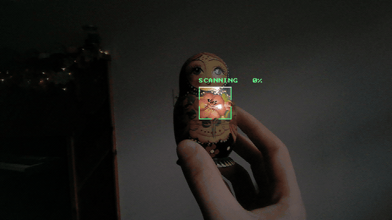
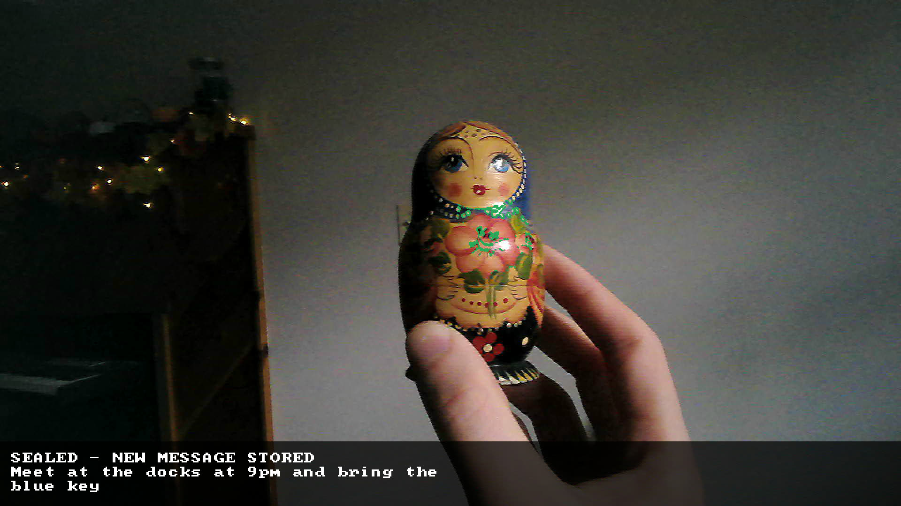
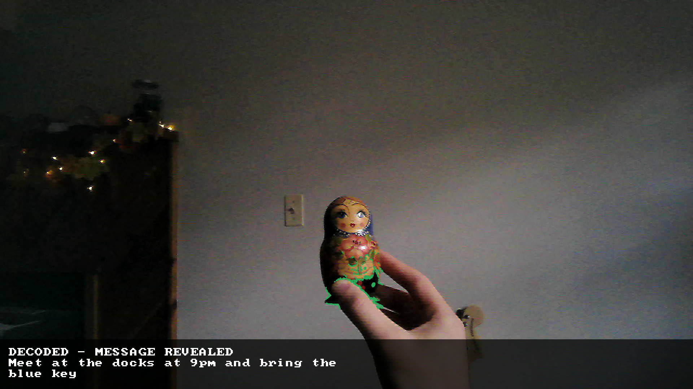

# 04_sealed_drawing



Draw something, type a message, and seal that message to the drawing
**and to one specific pair of glasses**. Hand the glasses over; whoever
wears them looks at the drawing through the onboard camera and the
message appears on the glasses' display. Any other pair of glasses sees
nothing but a locked record.

The cryptography is real and nothing is hand rolled: X25519,
HKDF-SHA256 and AES-256-GCM come from libcrypto (OpenSSL 3). The
hardware identity is the SHA-256 of the board serial, which is the only
form the VITURE SDK exposes it in.

## How the keys stack

```
identity (per pair of glasses, rebuilt live, never stored):
    seed = HKDF-SHA256(sn_hash || pin, salt = app-const, info = app-const)
    priv = seed            pub = X25519(priv, basepoint)

seal (sender, needs only the recipient's pub):
    eph_priv, eph_pub  <- fresh X25519 pair             asymmetric
    shared             <- X25519(eph_priv, pub)
    kek                <- HKDF-SHA256(shared, eph_pub || pub)
    dek                <- 32 random bytes
    wrapped_dek        <- AES-256-GCM(kek, dek,     aad = fingerprint)   symmetric 1
    ciphertext         <- AES-256-GCM(dek, message, aad = fingerprint)   symmetric 2

reveal (recipient, needs the glasses plugged in):
    rebuild priv from the live sn_hash  ->  shared  ->  kek  ->  dek  ->  message
```

- **Hardware ID in the key.** The private key is a pure function of
  the serial hash (and the optional `--pin`), so it is never written to
  disk and any host with those glasses attached can rebuild it. That is
  what lets the glasses be handed to someone else.
- **Asymmetric layer.** Because sealing needs only the public key, a
  message can be sealed for glasses that are not plugged in
  (`--recipient`), and the sender never holds the recipient's private
  key.
- **Two symmetric layers.** The message is encrypted under a random
  data key, and that data key is wrapped under the agreed key. Both are
  AES-256-GCM with the drawing fingerprint as authenticated data, so a
  record moved to a different drawing, a wrong key, or a flipped byte
  all fail the tag check cleanly (`[locked]`), never a garbled
  plaintext.
- **The object selects, the glasses open.** The painted object is located
  by colourful edge density (busy paint, not smooth skin or walls), and
  the area around it is fingerprinted with ORB-style local features:
  FAST corners on a small image pyramid, each with an orientation and a
  256-bit rotated BRIEF descriptor. A live view matches a stored one
  when at least 10 descriptor pairs agree on a single similarity
  transform (RANSAC). That survives tilt, rotation, distance and partial
  views; room shots score 6 or fewer. For texture-poor drawings that
  yield too few corners, a perceptual hash plus colour histogram score
  is the fallback (`--maxdist`). Only the right glasses can open it.

## Layout

| Module | Role |
|---|---|
| `keyring` | Derive the X25519 identity from the serial hash + PIN |
| `kdf` | HKDF-SHA256 wrapper around `EVP_KDF` |
| `envelope` | The seal / open construction above |
| `vault` | Append-only file of `{fingerprint, sealed blob}` records |
| `glasses_link` | Read the serial hash and count button presses via the SDK state callback |
| `camera` | Newest MJPEG frame from the glasses' camera (detaches uvcvideo, retries start) |
| `picture` | Keep captures: colour decode, caption band, BMP writer; quarter-res live preview |
| `scan` | Sobel outline of the scan area, traced by a sweeping line on the glasses |
| `actions` | Encode (multi-shot, message picker) / decode / one-shot flows |
| `locate` | Find the painted object: densest edge cluster in the view |
| `keypoints` | ORB-style local features: FAST corners, rotated BRIEF, RANSAC verification |
| `fingerprint` | One view's keypoints plus hash and colour; comparison and serialisation |
| `phash` | Fallback fingerprint: DCT hash of the located square at several tilts and zooms |
| `colorsig` | Hue/saturation histogram of the located square |
| `display`, `hud` | Put the revealed text on the glasses via SDL2 |
| `hexcodec`, `fileio`, `bytes` | Small helpers |

## Build

```sh
make            # bin/sealed_drawing (SDK + SDL2 + libcrypto)
```

Needs `pkg-config` entries for `sdl2` and `libcrypto` (OpenSSL 3).

## Use it

The hands-free way is `watch`:

```sh
make run ARGS="watch"
```

The glasses show the live camera view with green brackets marking the
search area. Put the painted object inside the brackets, a comfortable
arm's length away, and:

- **hold volume DOWN** for about a second and a half to **encode**: the
  frame is captured and the scan plays (the object's outline is traced
  by a sweeping line, then blinks LOCKED ON). Then keep the object in
  view and **turn it slowly**: three more views are taken over about two
  seconds, so the record holds four angles of it. Finally pick the
  message: `--message` if given, otherwise an on-glasses picker (tap
  volume up/down to move through the presets from `--messages <file>`
  or the built-in list, hold either way to confirm). The message is
  sealed to that object and to these glasses, and the result shows
  SEALED - NEW MESSAGE STORED over the picture.
- **hold volume UP** to **decode**: the object is looked up. A match
  shows DECODED - MESSAGE REVEALED with the message; a record sealed to
  other glasses shows LOCKED - NOT YOUR GLASSES; no record shows NOT
  FOUND.

Hand the glasses and `sealed.vault` over; the wearer holds volume UP on
the same object to read it.

How the buttons work: the SDK reports no presses, only state changes,
but the firmware auto-repeats the volume report while the rocker is
held, so a run of reports lasting over a second is a hold, and whether
the level climbs or falls tells UP from DOWN. The volume is parked at a
mid level while the program runs (so both directions are always
readable) and put back on exit. A long press on the other rocker is the
firmware's 2D/3D toggle; it is not a trigger, and if it fires the mode
is put straight back.

The one-shot commands still exist:

```sh
make run ARGS="identity"                                 # keys
make run ARGS='seal --message "meet at the docks, 9pm"'  # one frame
make run ARGS="reveal --display"                         # until Ctrl+C
make run ARGS="list"                                     # vault contents
make run ARGS="forget 2"                                 # drop record 2
```

Every capture is kept under `captures/` in the directory you run from:
`<stamp>_capture.jpg` is the original frame and `<stamp>_overlay.bmp` is
the same frame with the outcome drawn across the bottom. After a
capture the result stays on the glasses for five seconds, then the live
view resumes; a new hold cuts that short.

Two real ones, from a painted matryoshka doll on the Luma Ultra:

| Encode (volume DOWN) | Decode (volume UP) |
|---|---|
|  |  |

Options:

- `--pin <text>` mixes an extra secret into the identity. Use it on
  both seal and reveal; without it the record shows as locked.
- `--recipient <hex64>` seals for another pair's public key (from their
  `identity` output) while your own glasses supply the camera.
- `--messages <file>` preset messages for the on-glasses picker, one per
  line (five built-in ones are used if absent).
- `--maxdist <n>` hash-score threshold for texture-poor objects, default
  22. Textured objects are decided by keypoints and ignore it.
- `--captures <dir>` where pictures go (default `captures/`).
- `--windowed` shows the pictures in a desktop window instead of on the
  glasses; `--no-preview` stops `watch` from streaming the live view.

`seal` waits 20 frames for auto-exposure to settle, then grabs one frame
and exits. `reveal` and `watch` run until Ctrl+C or Esc.

`watch --image f.jpg --hash <hex64> --windowed` runs one capture offline,
animation and all, in a desktop window. `test/offline_test.sh` runs the
encode, decode, locked, not-found, list and forget paths on the sample
frames in `test/data/` and fails on any unexpected outcome; run it after
touching the matcher or the crypto.

## Test it without the headset

The identical pipeline runs on a JPEG with a supplied serial hash:

```sh
H=aaaaaaaaaaaaaaaaaaaaaaaaaaaaaaaaaaaaaaaaaaaaaaaaaaaaaaaaaaaaaaaa
./bin/sealed_drawing seal   --image drawing.jpg --hash $H --message "hello"
./bin/sealed_drawing reveal --image drawing.jpg --hash $H          # unlocked
./bin/sealed_drawing reveal --image drawing.jpg --hash ${H//a/b}   # locked
./bin/sealed_drawing reveal --image other.jpg   --hash $H          # no match
```

## Scope / limits

- Possession is the credential. Anyone who can plug the glasses in can
  rebuild the identity, which is the point of binding to hardware; add
  `--pin` if you want a second factor that travels separately.
- Keypoint matching needs texture: a painted or printed object works
  well, a plain silhouette drawing falls back to the hash score. Keep
  the object inside the brackets at arm's length in decent light; a busy
  or brightly coloured background (a monitor showing code, say) can draw
  the locator away from the object.
- The capture is taken the moment the hold completes, so aim first, then
  hold.
- Baseline JPEG only (what the camera emits). The vault file is local;
  nothing leaves the machine.

## Coding standard

Allman braces, Yoda comparisons, every local initialised to its null
value, single exit via `goto cleanup`, a blank line before every
`return`, no magic numbers, three or fewer parameters per function
(byte-span structs instead of pointer/length pairs), no `strlen` /
`strcpy` / `atoi` family, and no comments in `.c` files: each header
documents its functions as `Summary / Inputs / Outputs`.

See the top-level `README.md` for build prerequisites (the VITURE SDK is
not included and must be unpacked under `sdk/`).
